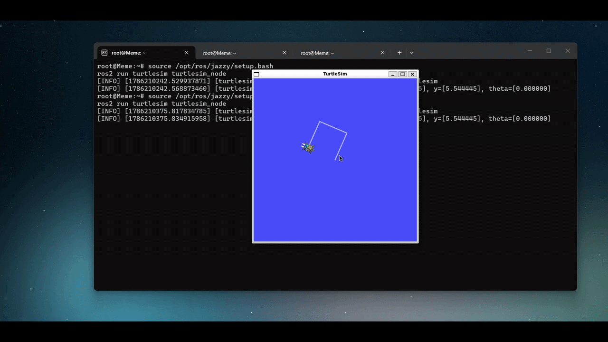

# 🐢 ROS2 Turtlesim: Precise Continuous Square



# 🚀 How to Run:
What we worked on is ROS2 (specifically the ROS2 Jazzy version as shown in the commands

## 1️⃣ First Terminal (Launch Simulator)
```bash
source /opt/ros/jazzy/setup.bash
ros2 run turtlesim turtlesim_node
```

## 2️⃣ Second Terminal (Reset Turtle & Center Direction)
```
ros2 service call /reset std_srvs/srv/Empty
ros2 topic pub --once /turtle1/cmd_vel geometry_msgs/msg/Twist "{linear: {x: 0.0}, angular: {z: 0.0}}"
```

## 3️⃣ Third Terminal (Run the Continuous Square Code)
```
nano precise_continuous_square.py
```
```
import rclpy
from rclpy.node import Node
from geometry_msgs.msg import Twist

class PreciseContinuousSquare(Node):
    def __init__(self):
        super().__init__('precise_continuous_square')
        self.publisher_ = self.create_publisher(Twist, '/turtle1/cmd_vel', 10)
        
        # ⏱️ Timer running 10 times per second (0.1s interval)
        self.timer = self.create_timer(0.1, self.timer_callback)
        
        # 📐 Precise step calculations for equal dimensions and exact 90-degree turns
        # Linear speed 2.0 for 1 second = side length of 2.0
        self.forward_steps = 10   # 10 steps * 0.1s = 1.0s moving forward
        # Angular speed 1.57 (approx. PI/2) for 1 second for a perfect right angle
        self.turn_steps = 10      # 10 steps * 0.1s = 1.0s turning
        
        self.step_counter = 0
        self.state = 0  # 0: Move Forward, 1: Turn

    def timer_callback(self):
        msg = Twist()

        if self.state == 0:  # Straight Side
            if self.step_counter < self.forward_steps:
                msg.linear.x = 2.0
                msg.angular.z = 0.0
                self.step_counter += 1
            else:
                # Side complete, start turning
                msg.linear.x = 0.0
                msg.angular.z = 0.0
                self.step_counter = 0
                self.state = 1
        
        elif self.state == 1:  # Right Angle Turn
            if self.step_counter < self.turn_steps:
                msg.linear.x = 0.0
                msg.angular.z = 1.57
                self.step_counter += 1
            else:
                # Turn complete, loop back to the next side (continuous infinite square)
                msg.linear.x = 0.0
                msg.angular.z = 0.0
                self.step_counter = 0
                self.state = 0

        self.publisher_.publish(msg)

def main(args=None):
    rclpy.init(args=args)
    node = PreciseContinuousSquare()
    try:
        rclpy.spin(node)
    except KeyboardInterrupt:
        pass
    finally:
        node.destroy_node()
        rclpy.shutdown()

if __name__ == '__main__':
    main()
```
```
source /opt/ros/jazzy/setup.bash
python3 precise_continuous_square.py
```

# ❓💡Troubleshooting & Solutions:
---
 ## Issue 1: Stopping and Failing to Continue Drawing
🛑Problem: In earlier code versions, the turtle would draw a single square and then completely terminate its execution. The goal was to make it loop and draw squares continuously without stopping.

💡Solution: We removed node termination commands (destroy_node and rclpy.shutdown) that used to shut down the program after completing the four sides. Instead, we configured it to reset the counter (self.step_counter = 0) to loop back to the beginning seamlessly.
```
self.step_counter = 0
self.state = 0
```
---

## Issue 2: Drift and Inaccurate 90-Degree Angles
🛑Problem: Relying purely on real-world time (time.time) in initial codes was sometimes affected by minor system lag, leading to slight deviations in turning angles or side lengths, making the square imprecise.

💡Solution: We replaced time-dependency with a step- or pulse-based system (Steps) via a timer. Using steady step counters tied to time intervals (self.forward_steps and self.turn_steps) ensures precise stops, exact right-angle turns, and uniform dimensions every single time.
```
self.forward_steps = 10
self.turn_steps = 10
```


